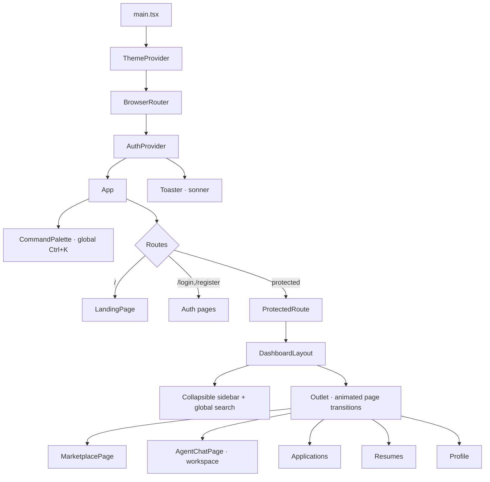
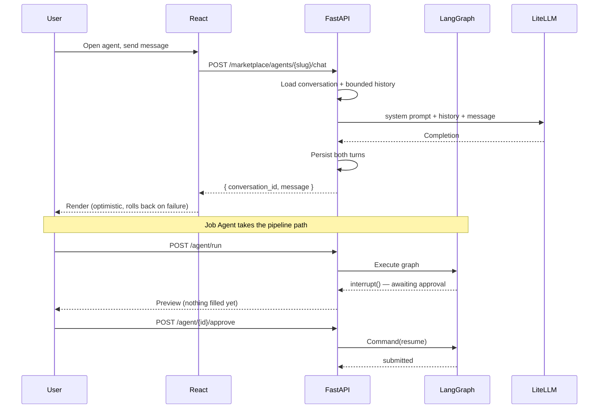

# LuminAI Design System

The visual and interaction language for LuminAI — a premium, dark-first AI agent
operating system. Reference for anyone building UI in this repo.

Design peers: Google AI Studio, Linear, Vercel, Raycast, Cursor.

---

## 1. Foundations

### 1.1 Semantic color tokens

Colors are **never** hard-coded in components. Every surface and text color
resolves through a semantic token defined as a CSS variable in
[`frontend/src/index.css`](frontend/src/index.css) and exposed to Tailwind in
[`frontend/tailwind.config.js`](frontend/tailwind.config.js).

This is why the app supports light mode without a single `dark:` variant
scattered through components — `bg-surface` is correct in every theme.

| Token | Tailwind class | Role | Dark | Light |
|---|---|---|---|---|
| `--bg` | `bg-bg` | Page floor | `#06070c` | `#fafbfd` |
| `--bg-elevated` | `bg-bg-elevated` | Nav, modals, popovers | `#0c0e16` | `#ffffff` |
| `--surface` | `bg-surface` | Cards, panels | `#121520` | `#ffffff` |
| `--surface-hover` | `bg-surface-hover` | Hover / pressed | `#1a1e2c` | `#f4f6fa` |
| `--line` | `border-line` | Default borders, dividers | `#222737` | `#e2e7ef` |
| `--line-strong` | `border-line-strong` | Emphasized borders | `#333a4f` | `#cbd2e0` |
| `--fg` | `text-fg` | Primary text | `#edf1f9` | `#0f1420` |
| `--fg-muted` | `text-fg-muted` | Secondary text | `#9ba5bb` | `#545f74` |
| `--fg-subtle` | `text-fg-subtle` | Tertiary / meta | `#6c768c` | `#7d889c` |

Tokens are stored as **space-separated RGB channels**, not hex, so Tailwind's
`<alpha-value>` can compose opacity on top of any token (`bg-surface/70`).

### 1.2 Brand palette

Sampled directly from the logo gradient (deep blue → cyan).

| Ramp | 300 | 400 | 500 | 600 | Usage |
|---|---|---|---|---|---|
| `brand` | `#8eb5ff` | `#5b8dfa` | `#3566ef` | `#1e4fd8` | Primary actions, active nav, focus |
| `cyan` | `#7ee7e0` | `#3fd0c9` | `#1fb5ae` | `#0f918c` | Gradient terminus, success accents |
| `violet` | `#c4b5fd` | `#a78bfa` | `#8b5cf6` | `#7c3aed` | Secondary accent, agent categories |

**Semantic status:** emerald (live/success), amber (setup needed/warning),
red (error/destructive).

**Per-agent accent:** each agent carries its own `accent` hex from the backend
registry, driving its icon gradient, card glow, and chat bubble. Agents stay
visually distinguishable without hard-coding ten palettes in the frontend.

### 1.3 Typography

**Inter** for UI, **JetBrains Mono** for code and metadata.

| Role | Class | Size / weight |
|---|---|---|
| Display | `text-4xl sm:text-6xl font-extrabold tracking-tight` | 36→60px / 800 |
| H1 (page) | `text-2xl font-bold tracking-tight` | 24px / 700 |
| H2 (section) | `text-3xl font-bold tracking-tight` | 30px / 700 |
| H3 (card) | `font-semibold` | 16px / 600 |
| Body | `text-sm leading-relaxed` | 14px / 400 |
| Meta | `text-xs` | 12px / 400 |
| Overline | `text-[0.65rem] font-semibold uppercase tracking-wider` | 10.4px / 600 |
| Mono | `font-mono text-[0.7rem]` | 11.2px / 400 |

`font-feature-settings: "cv02","cv03","cv04","cv11"` enables Inter's
single-storey glyph alternates for a more geometric, product-like tone.

### 1.4 Spacing & radius

4px base scale. Prefer `gap-*` over margins for rhythm inside flex/grid.

| Context | Value |
|---|---|
| Inline gap | `gap-1.5` / `gap-2` |
| Element gap | `gap-3` / `gap-4` |
| Card padding | `p-5` (marketplace) · `p-4` (list) · `p-6`–`p-8` (feature) |
| Section rhythm | `py-24` (landing) · `py-8` (dashboard) |
| Content width | `max-w-6xl` (shell) · `max-w-3xl` (forms) · `max-w-sm` (auth) |

Radius: `rounded-lg` (8px) controls · `rounded-xl` (14px) cards ·
`rounded-2xl` (18px) modals, hero panels · `rounded-full` pills.

### 1.5 Elevation

| Shadow | Use |
|---|---|
| `shadow-soft` | Inputs, subtle raise |
| `shadow-card` | Resting card |
| `shadow-card-hover` | Hovered card, modal, palette |
| `shadow-glow` | Primary button hover, active brand element |

---

## 2. Motion

Powered by **Framer Motion**. One easing curve everywhere:
`cubic-bezier(0.16, 1, 0.3, 1)` — fast out, gentle settle.

| Interaction | Duration | Notes |
|---|---|---|
| Hover / color | 150ms | CSS transition |
| Button press | — | `active:scale-[0.98]` |
| Page transition | 220ms | `AnimatePresence mode="wait"` |
| Card entrance | 400ms | Staggered `delay: min(i,8) * 50ms` |
| Section reveal | 550ms | `whileInView`, `once: true` |
| Command palette | 160ms | Scale + fade |
| Sidebar collapse | 220ms | Animated width |

**Rules**
1. Animate `transform` and `opacity` only — never `width`/`top`/`left` on hot paths (they force layout).
2. Cap stagger at ~8 items; beyond that it reads as lag, not polish.
3. Pointer-driven effects (tilt, magnetic) write to the DOM node via refs, never through React state — hovering must not re-render.
4. `prefers-reduced-motion` collapses all decorative animation to ~0ms globally (`index.css`).
5. Coarse pointers skip hover effects — a tilt firing on tap reads as a glitch.

---

## 3. Component library

Located in `frontend/src/components/`.

| Component | File | Notes |
|---|---|---|
| `Button` | `ui.tsx` | 5 variants × 3 sizes |
| `MagneticButton` | `ui.tsx` | Cursor-following CTA |
| `Input` / `Textarea` / `Select` | `ui.tsx` | Shared field styling |
| `Card` | `ui.tsx` | Base surface |
| `TiltCard` | `TiltCard.tsx` | 3D tilt + cursor specular |
| `Badge` | `ui.tsx` | 7 tones |
| `PageHeader` | `ui.tsx` | Title / subtitle / actions |
| `Skeleton`, `CardSkeletonList` | `ui.tsx` | Shimmer loaders |
| `Spinner`, `ErrorBanner`, `EmptyState` | `ui.tsx` | Async states |
| `Kbd` | `ui.tsx` | Shortcut key cap |
| `CommandPalette` | `CommandPalette.tsx` | Ctrl/Cmd+K |
| `AgentFlow` | `AgentFlow.tsx` | Animated multi-agent canvas |
| `ThemeToggle` | `ThemeToggle.tsx` | Dark / Light / System |
| `LogoMark`, `LogoLockup` | `brand/Logo.tsx` | SVG brand |
| `AgentIcon` | `AgentIcon.tsx` | Registry-keyed icons |

**Icons:** [Lucide](https://lucide.dev) at `h-4 w-4` (inline), `h-5 w-5` (nav),
`stroke-width 1.75`. Agent identity icons come from `AgentIcon`.

---

## 4. UI architecture



### Data flow



---

## 5. Layout & responsive

| Breakpoint | Width | Behavior |
|---|---|---|
| base | <640px | Single column; sidebar collapses to icon rail; flow stacks vertically |
| `sm` | ≥640px | 2-col agent grid; flow goes horizontal |
| `md` | ≥768px | Landing nav links appear; 3-col features |
| `lg` | ≥1024px | 3-col agent grid; full sidebar |
| `xl` | ≥1280px | `max-w-6xl` caps content |

### Wireframes

**Landing** — Nav · Hero (aurora + grid + animated flow preview) · Featured
agents · Workflow · Capabilities · Tech · Pricing · CTA · Footer.

```
┌────────────────────────────────────────────┐
│ [logo]   Agents Workflow Pricing  [☾][→]   │
├────────────────────────────────────────────┤
│              ● 10 agents live               │
│         The AI agent OPERATING SYSTEM       │
│          [Start building] [Browse]          │
│    ┌──────────────────────────────────┐     │
│    │ ○○○  luminai · workspace          │     │
│    │  ①─②─③─④─⑤─⑥─⑦  (animated)      │     │
│    └──────────────────────────────────┘     │
└────────────────────────────────────────────┘
```

**Dashboard / Marketplace**

```
┌────────┬───────────────────────────────────┐
│ ✦ LUM  │  Agent Marketplace      10 · 7    │
│ [🔍 ⌘K]│  [search......] All Career Prod   │
│        │  ┌──────┐ ┌──────┐ ┌──────┐       │
│ Discvr │  │ icon⭐│ │ icon⭐│ │ icon⭐│      │
│ ▸Market│  │ Name │ │ Name │ │ Name │       │
│        │  │ tags │ │ tags │ │ tags │       │
│ Workspc│  │★4.9 ↓│ │★4.8 ↓│ │★4.7 ↓│       │
│ ▸Apps  │  │[Open]│ │[Open]│ │[Open]│       │
│ ▸Run   │  └──────┘ └──────┘ └──────┘       │
│ ▸Resume│                                    │
│ [avatar]│                                   │
└────────┴───────────────────────────────────┘
```

**Agent workspace**

```
┌────────┬───────────────────────────────────┐
│ sidebar│ ← [icon] Agent Name  [Live] [Tool]│
│        ├───────────────────────────────────┤
│        │  ┌─ transcript ──────────────┐    │
│        │  │  [ai] message bubble      │    │
│        │  │          user bubble [me] │    │
│        │  │  [ai] ●●● typing          │    │
│        │  └───────────────────────────┘    │
│        │  [ compose........... ] [Send]    │
│        │  Enter send · Shift+Enter newline │
└────────┴───────────────────────────────────┘
```

---

## 6. Accessibility

- **Contrast:** body text ≥ 4.5:1, large text ≥ 3:1 in both themes.
- **Focus:** single global `:focus-visible` ring (2px brand-400, 2px offset). Never removed.
- **Keyboard:** palette is fully arrow/Enter/Escape driven; all controls reachable by Tab.
- **Semantics:** Radix primitives supply correct ARIA for dialog and menu. Icon-only buttons carry `aria-label` or `title`.
- **Motion:** `prefers-reduced-motion` honored globally.
- **Decoration:** ambient/aurora layers are `pointer-events: none` + `aria-hidden`.

---

## 7. Suggested Figma structure

```
LuminAI Design System (Figma)
├── 📄 00 · Cover
├── 📄 01 · Foundations
│   ├── Color — semantic tokens (Dark/Light variable modes)
│   ├── Color — brand/cyan/violet ramps
│   ├── Typography — Inter scale
│   ├── Spacing & radius
│   ├── Elevation
│   └── Iconography (Lucide)
├── 📄 02 · Components   ← published library
│   ├── Button (variant × size × state)
│   ├── Input / Textarea / Select
│   ├── Card / TiltCard
│   ├── Badge · Kbd · Skeleton
│   ├── Navigation (expanded / collapsed)
│   ├── Command Palette
│   └── Agent Card
├── 📄 03 · Patterns
│   ├── Empty / Loading / Error states
│   ├── Agent Flow canvas
│   └── Execution timeline
├── 📄 04 · Screens — Desktop
├── 📄 05 · Screens — Mobile
└── 📄 06 · Prototypes
```

**Conventions**
- Figma **variables** in Dark/Light modes, named to match CSS tokens exactly (`surface`, `fg-muted`) so design and code share one vocabulary.
- Component props mirror the React API (`variant`, `size`, `tone`).
- Grid: 8px baseline, 12-col at 1280px (72px gutter).

---

## 8. Roadmap

Specified in the product vision, not yet built:

- Execution timeline (tokens used, retries, per-step duration)
- Memory explorer over the pgvector store
- Installed-agents / running-tasks views
- Drag-and-drop workflow composer (the flow canvas is currently a visualization, not an editor)
- Recharts analytics
- Notification center
- Resizable split panes in the workspace

> **Note on marketplace metrics.** Agent `rating` and `installs` are static
> catalog figures in `backend/app/agents/registry.py`, not live telemetry —
> nothing counts installs or collects reviews yet. Wire them to real
> aggregates before presenting them as actual metrics.
